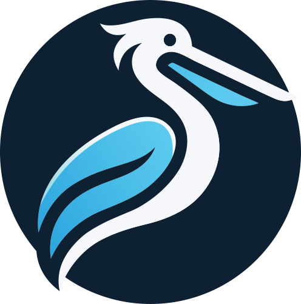

<div align="center">
    
    <h1>@voctal/pelican</h1>
    <p>
        <a href="https://voctal.dev/discord"></a>
        <a href="https://www.npmjs.com/package/@voctal/pelican"></a>
        <a href="https://www.npmjs.com/package/@voctal/pelican"></a>
        <a href="https://github.com/voctal/pelican/commits/main"></a>
    </p>
</div>

## About

`@voctal/pelican` allows you to easily use the [Pelican Panel](https://pelican.dev) API. See the [module documentation](https://docs.voctal.dev/docs/packages/pelican/stable).

You can find the Pelican API docs on your own panel at `https://<domain>/docs/api`, or on the demo: https://demo.pelican.dev/docs/api.

> [!NOTE]
> This module is still under development and does not include every features. Not everything was fully tested. However you can use the `rest` property of `PelicanApplication` and `PelicanClient` to access the API routes that this module does not support.

## Installation

Node.js 22 or newer is required.

```sh
npm install @voctal/pelican
```

## Example usage

Use PelicanApplication to interact with the Application API:

```js
import { PelicanApplication } from "@voctal/pelican";

const application = new PelicanApplication({
    token: "...",
    url: "https://example.com",
});

const servers = await application.servers.list();
const users = await application.users.list();
// See all methods on the documentation
```

Use PelicanClient to interact with the Client API:

```js
import { PelicanClient } from "@voctal/pelican";

const client = new PelicanClient({
    token: "...",
    url: "https://example.com",
});

const account = await application.account.get();
const servers = await application.servers.list();
const files = await application.files.list(serverId);
// See all methods on the documentation
```

If you are using the `REST` class, you might need the Zod schemas to validate the responses. They are all available from here:

```js
import { userSchema } from "@voctal/pelican/schemas";

userSchema.parse(data);
```

## Links

- [Module documentation](https://docs.voctal.dev/docs/packages/pelican/stable)
- [Discord server](https://voctal.dev/discord)
- [GitHub](https://github.com/voctal/pelican)
- [npm](https://npmjs.com/package/@voctal/pelican)
- [Voctal](https://voctal.dev)

## Help

Need help with the module? Ask on our [support server!](https://voctal.dev/discord)
